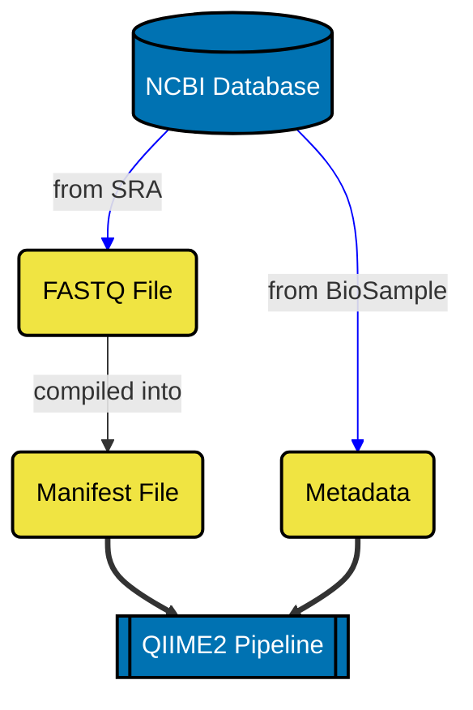
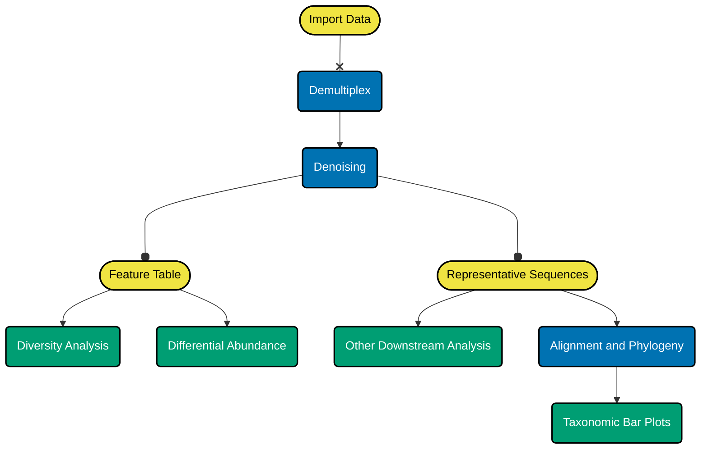

## AD Metagenome Analysis
This repository is a demonstration of obtaining raw sequences from the NCBI database using the SRA-toolkit, followed by
passing through those sequences to QIIME pipeline for pre-processing, and some downstream processing as suggested by the 
reference study.

### Requirements
-   Linux Environment (WSL is also applicable)
-   QIIME2 2023.9 (Amplicon Distribution)
-   Python Libraries (pandas, numpy, matplotlib, seaborn)
-   Dokdo API in Jupyter Notebook Usage
    
### Data Retrieval and Preparation

  process_sra.sh is a shell script file available to perform the sequence retrieval and conversion of .sra to .fastq files

### QIIME2 Pipeline

